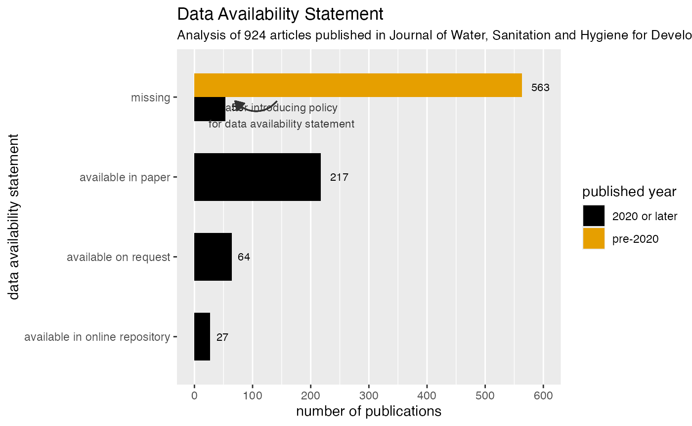

# Missed Opportunity: where is WASH research data gone?

## Background

In the sector of Water, Sanitation and Hygiene (WASH), very little data
is shared publicly and follows the best practices for reuse. The first
missed opportunity are journal articles and data from researchers which
often involves huge efforts in time, labor, and intelligence. One
strategy to improve this is to implement a **Data Availability
Statement** together with the published journal article. A data
availability statement indicates how the data used in the study is
accessed and shared. For the journal of Water, Sanitation and Hygiene
for Development, 3 options are offered for the authors to decide which
best describes their data:

- All relevant data are included in the paper or its Supplementary
  Information.
- Data cannot be made publicly available; readers should contact the
  corresponding author for details.
- All relevant data are available from an online repository

Using the dataset `washdev` from the `washopenresearch` data package,
this example investigates the “Data Availability Statement” from 924
articles published in the Journal of Water, Sanitation and Hygiene for
Development from 2011 to 2023.

``` r

# Import useful libraries
## Package installation if you do not have them, uncomment and run the following two lines
## install.packages(c("tidyverse", "devtools", "ggthemes", "gt"))
## devtools::install_github("washopenresearch")
library(washopenresearch)
library(tidyverse)
library(ggthemes)
library(gt)
```

## How is WASH research data available in the journal?

In 2020, the journal implemented a policy change to ask for including a
data availability statement (DAS) for publications. In this section, the
goal is to understand the impact of the DAS policy change and the
distribution of different types of DAS.

### 1. Data Preparation

Let’s start by having an overview of the data where we can find relevant
variables like `published_year`, `has_das`, `das_type` to be used for
analysis.

``` r

glimpse(washdev)
#> Rows: 924
#> Columns: 28
#> $ paperid                                   <int> 28742, 28745, 28743, 28744, …
#> $ volume                                    <int> 1, 1, 1, 1, 1, 1, 1, 1, 1, 1…
#> $ issue                                     <int> 1, 1, 1, 1, 1, 1, 1, 2, 2, 2…
#> $ paper_url                                 <chr> "https://iwaponline.com/wash…
#> $ journal                                   <chr> "Journal of Water, Sanitatio…
#> $ title                                     <chr> "Editorial", "The sanitation…
#> $ published_year                            <dbl> 2011, 2011, 2011, 2011, 2011…
#> $ is_supp                                   <lgl> FALSE, FALSE, FALSE, TRUE, F…
#> $ num_supp                                  <int> 0, 0, 0, 1, 0, 0, 0, 0, 0, 0…
#> $ supp_file_type                            <chr> NA, NA, NA, "pdf", NA, NA, N…
#> $ supp_url                                  <chr> NA, NA, NA, "https://iwa.sil…
#> $ num_authors                               <int> 6, 5, 6, 2, 2, 2, 3, 2, 3, 8…
#> $ first_author_name                         <chr> "Jamie Bartram", "E. Kvarnst…
#> $ first_author_affiliation                  <chr> "Journal of Water, Sanitatio…
#> $ first_author_affiliation_country          <chr> NA, "Sweden", "Cameroon", "I…
#> $ first_author_email                        <chr> NA, "elisabeth.kvarnstrom@se…
#> $ first_author_orcid                        <chr> NA, NA, NA, NA, NA, NA, NA, …
#> $ correspondence_author_name                <chr> NA, "E. Kvarnström", "E. Soh…
#> $ correspondence_author_affiliation         <chr> NA, "Stockholm Environment I…
#> $ correspondence_author_affiliation_country <chr> NA, "Sweden", "Cameroon", "I…
#> $ correspondence_author_email               <chr> NA, "elisabeth.kvarnstrom@se…
#> $ correspondence_author_orcid               <chr> NA, NA, NA, NA, NA, NA, NA, …
#> $ has_das                                   <lgl> FALSE, FALSE, FALSE, FALSE, …
#> $ das                                       <chr> NA, NA, NA, NA, NA, NA, NA, …
#> $ das_type                                  <fct> NA, NA, NA, NA, NA, NA, NA, …
#> $ das_repo_url                              <chr> NA, NA, NA, NA, NA, NA, NA, …
#> $ keywords                                  <chr> NA, "function-based; sanitat…
#> $ url_source                                <chr> "iwaponline.com", "iwaponlin…
```

We prepare the data by first creating a new variable `das_policy` based
on `published_year` to distinguish whether the publication is before or
after the DAS policy change. Then, we modify the `das_type` to be more
human-readable and add a new type `"missing` for all the publications
that do not have a DAS.

``` r

washdev_das_type <- washdev |> 
    mutate(das_policy = case_when(
        published_year < 2020 ~ "pre-2020",
        TRUE ~ "2020 or later"
    )) |> 
    mutate(das_type = case_when(
        das_type == "in paper" ~ "available in paper",
        das_type == "on request" ~ "available on request",
        TRUE ~ das_type
    ))  |>     
    mutate(das_type = case_when(
        is.na(das_type) ~ "missing",
        TRUE ~ das_type
    )) 
```

Now, we can summarize for data availability statement (DAS) type and
policy year.

``` r

washdev_das_type_n <- washdev_das_type |> 
    count(das_policy, das_type) 
washdev_das_type_n
#> # A tibble: 5 × 3
#>   das_policy    das_type                           n
#>   <chr>         <chr>                          <int>
#> 1 2020 or later available in online repository    27
#> 2 2020 or later available in paper               217
#> 3 2020 or later available on request              64
#> 4 2020 or later missing                           53
#> 5 pre-2020      missing                          563
```

### 2. Visualization on Data Availability Statement Types

We use a barplot to visualize the information with the following code.
In addition, we annnotate the policy change to highlight the impact.

``` r

fig_das_type <- washdev_das_type_n |> 
    ggplot(aes(x = reorder(das_type, n), y = n, fill = das_policy)) +
    geom_col(position = position_dodge(), width = 0.6) +
    geom_text(aes(label = n), 
              vjust = 0.5, 
              hjust = -0.5,  
              size = 3,
              position = position_dodge(width = 0.5)
    ) +
    coord_flip() +
    # Add annotation about policy change
    annotate("text", 
             x = 3.77, 
             y = 150, 
             size = 3, 
             label = "after introducing policy\nfor data availability statement", 
             color = "gray20") +
    geom_curve(aes(x = 3.95, y = 142, xend = 3.95, yend = 70), 
               curvature = 0.5, 
               arrow = arrow(type = "closed", length = unit(0.1, "inches")),
               color = "gray20") +
    # Style of the figure
    labs(
        title = "Data Availability Statement",
        subtitle = "Analysis of 924 articles published in Journal of Water, Sanitation and Hygiene for Development (2011 to 2023)",
        fill = "published year",
        y = "number of publications",
        x = "data availability statement") +
    scale_y_continuous(breaks = seq(0, 600, 100), limits = c(0,600)) +
    scale_fill_colorblind() +
    theme(panel.grid.major.y = element_blank(),
          plot.subtitle = element_text(size = 10))
#> Warning: `scale_fill_colorblind()` was deprecated in ggthemes 5.2.0.
#> This warning is displayed once per session.
#> Call `lifecycle::last_lifecycle_warnings()` to see where this warning was
#> generated.

# https://www.iwapublishing.com/news/iwa-publishing-2020-annual-review
```

``` r

# Display the figure
fig_das_type
```



- You can see the data availability statements on the vertical axis and
  the number of publications on the horizontal axis

- Colors differentiate between papers published before 2020 and in 2020
  or later, when a policy was introduced that requires authors to select
  one of the three data availability statements

- After that policy was introduced, we still found 15% of papers without
  a data availability statement, while 60% of articles stated that data
  was available in the paper, which could also be as supplementary
  material

## What file types are researchers choosing for supplementary materials?

From the above analysis, we can see that many people opt for data
available within the paper or supplementary materials. What file types
are researchers choosing for supplementary materials? Are they PDF
reports, word documents, or spreadsheets?

Answers to these questions are important to understand the data
accessibility. Data stored and uploaded in pdf reports are less ideal
for reuse and reproducibility. Therefore, in this section, we look at
the supplementary mateirials with the variable `supp_file_type` that
lists out the file types of supplementary materials.

### 1. Data Preparation

We look at the Supplementary Material of all articles published in 2020
or later. In particular, the variable `supp_file_type` stores the file
types of an article as a single string separated by `"; "` when an
article has several files. We use `separate_rows` to expand information
as follows.

``` r

washdev_supp_file_type_n <- washdev_das_type |>
    filter(das_policy == "2020 or later") |>
    select(paperid, das_type, supp_file_type) |>
    separate_rows(supp_file_type, sep = "; ") |>
    mutate(supp_file_type = case_when(
        is.na(supp_file_type) ~ "missing",
        TRUE ~ supp_file_type
    )) |>
    count(das_type, supp_file_type) 
washdev_supp_file_type_n
#> # A tibble: 16 × 3
#>    das_type                       supp_file_type     n
#>    <chr>                          <chr>          <int>
#>  1 available in online repository docx              21
#>  2 available in online repository missing            8
#>  3 available in online repository pdf                2
#>  4 available in online repository xlsx               2
#>  5 available in paper             docx              83
#>  6 available in paper             missing          125
#>  7 available in paper             pdf                7
#>  8 available in paper             png                1
#>  9 available in paper             pptx               4
#> 10 available in paper             xlsx              22
#> 11 available on request           docx              33
#> 12 available on request           missing           29
#> 13 available on request           pdf                2
#> 14 missing                        docx              12
#> 15 missing                        missing           40
#> 16 missing                        pdf                2
```

### 2. Summary on Supplementary Material File Types

We aggregate each file type to show the distribution of files types used
in the supplementary materials.

``` r

tbl_supp_type <- washdev_supp_file_type_n |> 
    group_by(supp_file_type) |> 
    summarise(n = sum(n)) |> 
    arrange(desc(n)) |> 
    mutate(perc = n / sum(n) * 100) 
```

``` r

# Display the table
tbl_supp_type |> 
    gt() |> 
    tab_header(title = "Supplementary Material",
               subtitle = "Articles published 2020 or later") |>
    tab_style(locations = cells_column_labels(), 
              style = cell_text(weight = "bold")) |>
    fmt_number(columns = c(perc), decimals = 1) |> 
    cols_label(supp_file_type = "file type", n = "n", perc = "%") |> 
    tab_footnote(
        footnote = md("One article can have multiple files."),
        locations = cells_column_labels(columns = n)
        )
```

| Supplementary Material                 |     |      |
|----------------------------------------|-----|------|
| Articles published 2020 or later       |     |      |
| file type                              | n¹  | %    |
| missing                                | 202 | 51.4 |
| docx                                   | 149 | 37.9 |
| xlsx                                   | 24  | 6.1  |
| pdf                                    | 13  | 3.3  |
| pptx                                   | 4   | 1.0  |
| png                                    | 1   | 0.3  |
| ¹ One article can have multiple files. |     |      |

- Half of the published articles still had no data published alongside
  the article

- But, the most insightful take-away is that not a single file was
  shared in a file type format that would qualify for following FAIR
  principles for data sharing.

- That is something we are hoping to change, where sharing data as CSV
  files would already go a long way.
