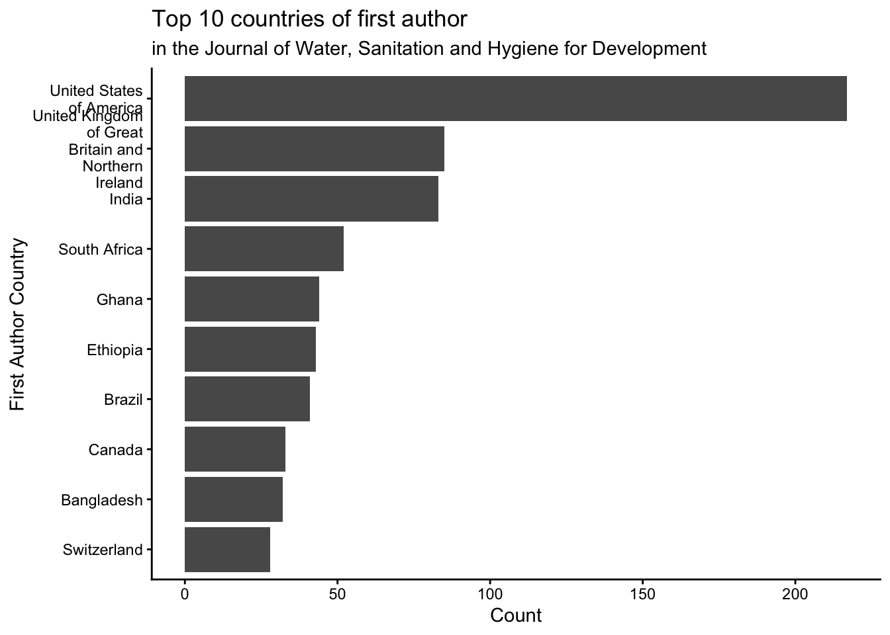
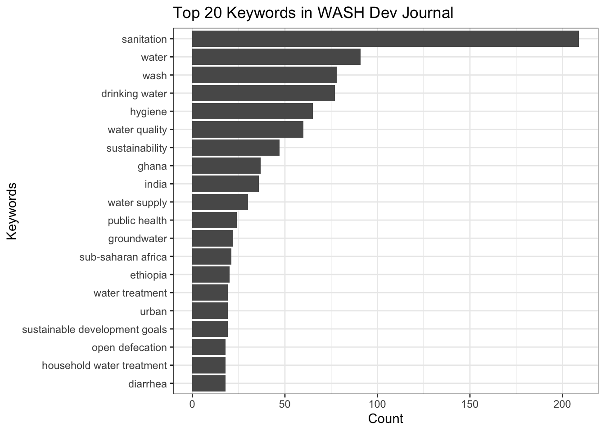
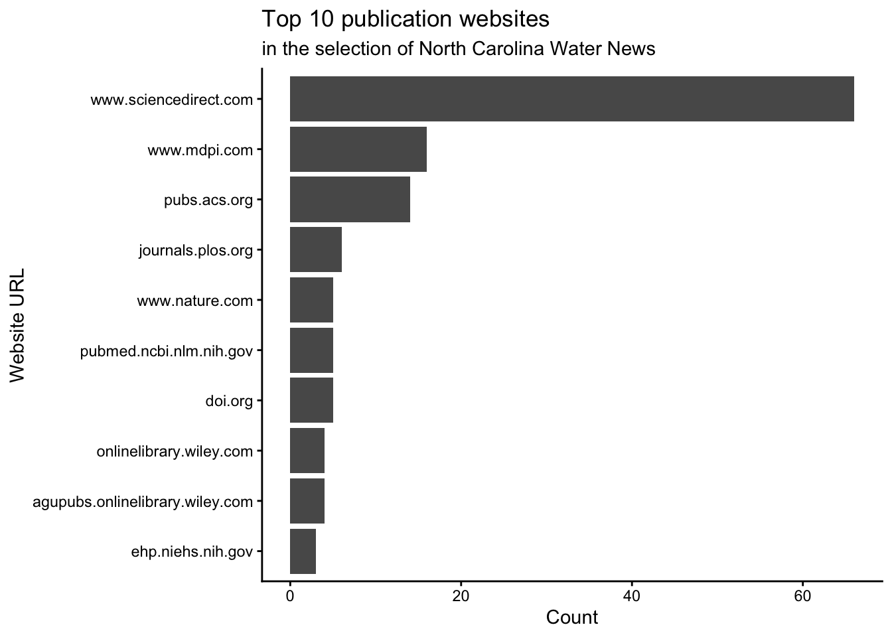

# washopenresearch

The goal of washopenresearch is to provide an overview of open research
data related to Water Sanitation and Hygiene (WASH). The current version
contains seven datasets from the following sources:

- `washdev`: Open access journal [*Journal of Water, Sanitation and
  Hygiene for Development*](https://iwaponline.com/washdev)
- `ws`: Journal [*Water Supply*](https://iwaponline.com/ws)
- `jwh`: Journal [*Journal of Water and
  Health*](https://iwaponline.com/jwh)
- `aqua`: Journal [*AQUA - Water Infrastructure, Ecosystems and
  Society*](https://iwaponline.com/aqua)
- `uncnewsletter`: Research section of the newsletter [North Carolina
  Water
  News](https://waterinstitute.unc.edu/our-work/nc-water-news-newsletter)
- `ploswater`: Open access journal [*PLOS
  Water*](https://journals.plos.org/water/)
- `datapapers`: WASH-related data papers in seven dedicated data
  journals ([Scientific Data](https://www.nature.com/sdata/), [Data in
  Brief](https://www.sciencedirect.com/journal/data-in-brief), [Gates
  Open Research](https://gatesopenresearch.org),
  [F1000Research](https://f1000research.com),
  [GigaScience](https://academic.oup.com/gigascience),
  [GigaByte](https://gigabytejournal.com), and
  [Data](https://www.mdpi.com/journal/data)), harvested from Crossref
  and Europe PMC


Word cloud of the most frequent keywords in articles of the Journal of
Water, Sanitation and Hygiene for Development, with water, sanitation,
and hygiene appearing largest

## Installation

You can install the development version of washopenresearch from
[GitHub](https://github.com/) with:

``` r

# install.packages("devtools")
devtools::install_github("openwashdata/washopenresearch")
```

Alternatively, you can download the individual datasets as a CSV or XLSX
file from the table below.

| dataset | CSV | XLSX |
|:---|:---|:---|
| washdev | [Download CSV](https://github.com/openwashdata/washopenresearch/raw/main/inst/extdata/washdev.csv) | [Download XLSX](https://github.com/openwashdata/washopenresearch/raw/main/inst/extdata/washdev.xlsx) |
| uncnewsletter | [Download CSV](https://github.com/openwashdata/washopenresearch/raw/main/inst/extdata/uncnewsletter.csv) | [Download XLSX](https://github.com/openwashdata/washopenresearch/raw/main/inst/extdata/uncnewsletter.xlsx) |
| ploswater | [Download CSV](https://github.com/openwashdata/washopenresearch/raw/main/inst/extdata/ploswater.csv) | [Download XLSX](https://github.com/openwashdata/washopenresearch/raw/main/inst/extdata/ploswater.xlsx) |
| datapapers | [Download CSV](https://github.com/openwashdata/washopenresearch/raw/main/inst/extdata/datapapers.csv) | [Download XLSX](https://github.com/openwashdata/washopenresearch/raw/main/inst/extdata/datapapers.xlsx) |
| ws | [Download CSV](https://github.com/openwashdata/washopenresearch/raw/main/inst/extdata/ws.csv) | [Download XLSX](https://github.com/openwashdata/washopenresearch/raw/main/inst/extdata/ws.xlsx) |
| jwh | [Download CSV](https://github.com/openwashdata/washopenresearch/raw/main/inst/extdata/jwh.csv) | [Download XLSX](https://github.com/openwashdata/washopenresearch/raw/main/inst/extdata/jwh.xlsx) |
| aqua | [Download CSV](https://github.com/openwashdata/washopenresearch/raw/main/inst/extdata/aqua.csv) | [Download XLSX](https://github.com/openwashdata/washopenresearch/raw/main/inst/extdata/aqua.xlsx) |

## Data

The package provides access to seven datasets `washdev`, `ws`, `jwh`,
`aqua`, `uncnewsletter`, `ploswater`, and `datapapers`. Each dataset
collects information on scientific articles about (1) article metadata
(e.g. title, first author, correspondence author), (2) supplementary
material information, (3) data availability statement or linked data
repository, and (4) semantic information (e.g. keywords or abstract).

Author email addresses were removed in version 0.4.0. They are personal
data, and the research questions this package serves use author country,
data availability statement type, keywords and supplementary counts
rather than contact details. Author names, affiliations and ORCIDs are
kept, since ORCIDs are persistent public identifiers built for
attribution.

``` r

library(washopenresearch)
```

### Coverage and updates

Five datasets are updated monthly. Each data release adds the journal
issues published since the last one. `uncnewsletter` and `datapapers`
are frozen: they are still built with every release but no longer
updated. The table shows what each dataset covers in this version.

| Dataset | Updates | Articles | Years | Latest issue |
|:---|:---|---:|:---|:---|
| `washdev` | monthly | 1,173 | 2011 to 2026 | Vol. 16 Issue 6 |
| `ws` | monthly | 4,884 | 2001 to 2026 | Vol. 26 Issue 6 |
| `jwh` | monthly | 2,013 | 2003 to 2026 | Vol. 24 Issue 6 |
| `aqua` | monthly | 1,819 | 1998 to 2026 | Vol. 75 Issue 6 |
| `ploswater` | monthly | 434 | 2022 to 2026 | Vol. 5 Issue 7, published up to 2026-07-06 |
| `uncnewsletter` | frozen | 173 | 2020 to 2023 | newsletter ceased in May 2024 |
| `datapapers` | frozen | 8 | 2018 to 2025 | harvested on 23 July 2026 |

### washdev

The dataset `washdev` contains data on open access articles of the
*Journal of Water, Sanitation & Hygiene for Development* (Vol. 1 Issue 1
to Vol. 16 Issue 6). It has 1173 observations from March 2011 to 2026.

``` r

washdev |> 
  head(3) |> 
  gt::gt() |>
  gt::as_raw_html()
```

| paperid | volume | issue | paper_url | journal | title | published_year | is_supp | num_supp | supp_file_type | supp_url | num_authors | first_author_name | first_author_affiliation | first_author_affiliation_country | first_author_orcid | correspondence_author_name | correspondence_author_affiliation | correspondence_author_affiliation_country | correspondence_author_orcid | has_das | das | das_type | das_repo_url | keywords | doi | url_source |
|---:|---:|---:|:---|:---|:---|---:|:--:|---:|:---|:---|---:|:---|:---|:---|:---|:---|:---|:---|:---|:--:|:---|:--:|:---|:---|:---|:---|
| 28742 | 1 | 1 | <https://iwaponline.com/washdev/article/1/1/1/28742/Editorial> | Journal of Water, Sanitation & Hygiene for Development | Editorial | 2011 | FALSE | 0 | NA | NA | 6 | Jamie Bartram | Journal of Water, Sanitation and Hygiene for Development | NA | NA | NA | NA | NA | NA | FALSE | NA | NA | NA | NA | 10.2166/washdev.2011.0001 | iwaponline.com |
| 28745 | 1 | 1 | <https://iwaponline.com/washdev/article/1/1/3/28745/The-sanitation-ladder-a-need-for-a-revamp> | Journal of Water, Sanitation & Hygiene for Development | The sanitation ladder – a need for a revamp? | 2011 | FALSE | 0 | NA | NA | 5 | E. Kvarnström | Stockholm Environment Institute, Kräftriket 2B, SE-10691 Stockholm, Sweden | Sweden | NA | E. Kvarnström | Stockholm Environment Institute, Kräftriket 2B, SE-10691 Stockholm, Sweden | Sweden | NA | FALSE | NA | NA | NA | function-based; sanitation technologies; sustainability; the sanitation ladder | 10.2166/washdev.2011.014 | iwaponline.com |
| 28743 | 1 | 1 | <https://iwaponline.com/washdev/article/1/1/13/28743/Vertical-flow-constructed-wetlands-as-an-emerging> | Journal of Water, Sanitation & Hygiene for Development | Vertical-flow constructed wetlands as an emerging solution for faecal sludge dewatering in developing countries | 2011 | FALSE | 0 | NA | NA | 6 | I. M. Kengne | Laboratory of Plant Biotechnology and Environment, Faculty of Science, University Yaoundé I, PO Box 812, Yaoundé, Cameroon | Cameroon | NA | E. Soh Kengne | Laboratory of Plant Biotechnology and Environment, Faculty of Science, University Yaoundé I, PO Box 812, Yaoundé, Cameroon | Cameroon | NA | FALSE | NA | NA | NA | biosolid accumulation; Cyperus papyrus; Echinochloa pyramidalis; faecal sludge dewatering; pollutant removal efficiencies; vertical-flow constructed wetlands | 10.2166/washdev.2011.001 | iwaponline.com |

For an overview of the variable names, see the following table.

| variable_name | variable_type | description |
|:---|:---|:---|
| paperid | integer | ID number of the paper on the journal website |
| volume | integer | Volume number of the journal |
| issue | integer | Issue number of the journal |
| paper_url | character | Official website url of the paper |
| journal | character | Full name of the journal |
| title | character | Title of the paper |
| published_year | integer | Year of publication |
| is_supp | logical | Whether the paper has supplementary materials |
| num_supp | integer | Number of supplementary material files |
| supp_file_type | character | File types of the supplementary materials separated by a semicolon when there are multiple |
| supp_url | character | Website urls of the supplementary materials separated by a semicolon when there are multiple |
| num_authors | integer | Number of the authors |
| first_author_name | character | Name of the first author |
| first_author_affiliation | character | Academic affiliation of the first author |
| first_author_affiliation_country | character | Country of the first author parsed from first_author_affiliation variable encoded with United Nations names |
| first_author_orcid | character | ORCID of the first author |
| correspondence_author_name | character | Name of the correspondence author |
| correspondence_author_affiliation | character | Academic affiliation of the correspondence author |
| correspondence_author_affiliation_country | character | Country of the correspondence author parsed from correspondence_author_affiliation variable encoded with United Nations names |
| correspondence_author_orcid | character | ORCID of the correspondence author |
| has_das | logical | Whether the paper has a data availability statement |
| das | character | Original data availability statement of the paper. NA if it does not have a data availability statement. |
| das_type | factor | Type of the data availability statement including “in paper”(data in full paper scope like supplementary material or appendix or main content) “on request”(data available on request to the authors) “available in online repository”(data is shared in a public online repository) “not shareable”(data is not shareable). NA if it does not have a data availability statement. |
| das_repo_url | character | Website urls of the data if the relevant data of the paper is shared on a public repository separated by a semicolon when there are multiple |
| keywords | character | Keywords of the paper separated by a semicolon |
| url_source | character | Publisher website of the paper |
| doi | character | DOI of the paper. Collected by the R scraper for recent articles and backfilled via Crossref for legacy rows (issue \#20); NA where no Crossref match was found (see data-raw/washdev-doi-review.csv) |

### ws

The dataset `ws` contains data on all articles of the journal [*Water
Supply*](https://iwaponline.com/ws), collected with the same R scraper
as `washdev` and sharing its schema. It has 4884 observations from 2001
to 2026, the longest run in the package. Water Supply does not enforce a
data availability policy, so most articles carry no statement at all;
where one exists, `das_type` records what it claims.

``` r

ws |>
  head(3) |>
  gt::gt() |>
  gt::as_raw_html()
```

| paperid | volume | issue | paper_url | journal | title | published_year | is_supp | num_supp | supp_file_type | supp_url | num_authors | first_author_name | first_author_affiliation | first_author_affiliation_country | first_author_orcid | correspondence_author_name | correspondence_author_affiliation | correspondence_author_affiliation_country | correspondence_author_orcid | has_das | das | das_type | das_repo_url | keywords | doi | url_source |
|---:|---:|---:|:---|:---|:---|---:|:--:|---:|:---|:---|---:|:---|:---|:---|:---|:---|:---|:---|:---|:--:|:---|:--:|:---|:---|:---|:---|
| 25410 | 1 | 1 | <https://iwaponline.com/ws/article/1/1/1/25410/Drinking-water-treatment-understanding-the> | Water Supply | Drinking water treatment - understanding the processes and meeting the challenges | 2001 | FALSE | 0 | NA | NA | 1 | Don Bursill | Cooperative Research Centre for Water Quality and Treatment, Salisbury, South Australia | NA | NA | NA | NA | NA | NA | FALSE | NA | NA | NA | drinking water treatment; natural organic matter; membranes; activated carbon; MIEX® | 10.2166/ws.2001.0001 | iwaponline.com |
| 25440 | 1 | 1 | <https://iwaponline.com/ws/article/1/1/9/25440/Traditional-and-novel-reservoir-management> | Water Supply | Traditional and novel reservoir management techniques to enhance water quality for subsequent potable water treatment | 2001 | FALSE | 0 | NA | NA | 4 | R. Bayley | Thames Water Utilities Limited, Water Supply Technical Services, Walton Advanced Water Treatment Works, Hurst Road, Walton-on-Thames, Surrey KT12 2EG, UK | United Kingdom of Great Britain and Northern Ireland | NA | NA | NA | NA | NA | FALSE | NA | NA | NA | algae; biomanipulation; Computational Fluid Dynamics; eutrophic; mixing; treatment | 10.2166/ws.2001.0002 | iwaponline.com |
| 25418 | 1 | 1 | <https://iwaponline.com/ws/article/1/1/17/25418/Artificial-mixing-to-reduce-growth-of-the-blue> | Water Supply | Artificial mixing to reduce growth of the blue-green alga Microcystis in Lake Nieuwe Meer, Amsterdam: an evaluation of 7 years of experience | 2001 | FALSE | 0 | NA | NA | 4 | E. Jungo | Jungo Engineering Ltd., Schaffhauserstrasse 331, CH-8050 Zurich, Switzerland | Switzerland | NA | E. Jungo | Jungo Engineering Ltd., Schaffhauserstrasse 331, CH-8050 Zurich, Switzerland | Switzerland | NA | FALSE | NA | NA | NA | artificial mixing; bubble plumes; cyanobacteria; dams; lake restoration; Microcystis; Nieuwe Meer; removal; reservoirs; toxins | 10.2166/ws.2001.0003 | iwaponline.com |

For an overview of the variable descriptions, see the following table.

| variable_name | variable_type | description |
|:---|:---|:---|
| paperid | integer | ID number of the paper on the journal website |
| volume | integer | Volume number of the journal |
| issue | character | Issue number of the journal, as text because combined issues (for example “1-2”) occur |
| paper_url | character | Official website url of the paper |
| journal | character | Full name of the journal |
| title | character | Title of the paper |
| published_year | numeric | Year of publication |
| is_supp | logical | Whether the paper has supplementary materials |
| num_supp | integer | Number of supplementary material files |
| supp_file_type | character | File types of the supplementary materials separated by a semicolon when there are multiple |
| supp_url | character | Website urls of the supplementary materials separated by a semicolon when there are multiple |
| num_authors | integer | Number of the authors |
| first_author_name | character | Name of the first author |
| first_author_affiliation | character | Academic affiliation of the first author |
| first_author_affiliation_country | character | Country of the first author parsed from first_author_affiliation variable encoded with United Nations names |
| first_author_orcid | character | ORCID of the first author |
| correspondence_author_name | character | Name of the correspondence author |
| correspondence_author_affiliation | character | Academic affiliation of the correspondence author |
| correspondence_author_affiliation_country | character | Country of the correspondence author parsed from correspondence_author_affiliation variable encoded with United Nations names |
| correspondence_author_orcid | character | ORCID of the correspondence author |
| has_das | logical | Whether the paper has a data availability statement |
| das | character | Original data availability statement of the paper. NA if it does not have a data availability statement. |
| das_type | factor | Type of the data availability statement including “in paper”(data in full paper scope like supplementary material or appendix or main content) “on request”(data available on request to the authors) “available in online repository”(data is shared in a public online repository) “not shareable”(data is not shareable). NA if it does not have a data availability statement. |
| das_repo_url | character | Website urls of the data if the relevant data of the paper is shared on a public repository separated by a semicolon when there are multiple |
| keywords | character | Keywords of the paper separated by a semicolon |
| doi | character | DOI of the paper. Collected by the R scraper; populated for every row |
| url_source | character | Publisher website of the paper |

### jwh

The dataset `jwh` contains data on all articles of the [*Journal of
Water and Health*](https://iwaponline.com/jwh), collected with the same
R scraper as `washdev` and sharing its schema. It has 2013 observations
from 2003 to 2026. Like Water Supply, it does not enforce a data
availability policy.

``` r

jwh |>
  head(3) |>
  gt::gt() |>
  gt::as_raw_html()
```

| paperid | volume | issue | paper_url | journal | title | published_year | is_supp | num_supp | supp_file_type | supp_url | num_authors | first_author_name | first_author_affiliation | first_author_affiliation_country | first_author_orcid | correspondence_author_name | correspondence_author_affiliation | correspondence_author_affiliation_country | correspondence_author_orcid | has_das | das | das_type | das_repo_url | keywords | doi | url_source |
|---:|---:|---:|:---|:---|:---|---:|:--:|---:|:---|:---|---:|:---|:---|:---|:---|:---|:---|:---|:---|:--:|:---|:--:|:---|:---|:---|:---|
| 1786 | 1 | 1 | <https://iwaponline.com/jwh/article/1/1/1/1786/Editorial> | Journal of Water and Health | Editorial | 2003 | FALSE | 0 | NA | NA | 1 | Joan Jofre | Health Related Water Microbiology Specialist Group, International Water Association | NA | NA | NA | NA | NA | NA | FALSE | NA | NA | NA | NA | 10.2166/wh.2003.0001 | iwaponline.com |
| 1789 | 1 | 1 | <https://iwaponline.com/jwh/article/1/1/3/1789/The-potential-for-health-risks-from-intrusion-of> | Journal of Water and Health | The potential for health risks from intrusion of contaminants into the distribution system from pressure transients | 2003 | FALSE | 0 | NA | NA | 5 | Mark W. LeChevallier | American Water, 1025 Laurel Oak Rd, PO Box 1770, Voorhees, NJ 08043, USA | United States of America | NA | Mark W. LeChevallier | American Water, 1025 Laurel Oak Rd, PO Box 1770, Voorhees, NJ 08043, USA | United States of America | NA | FALSE | NA | NA | NA | contamination; distribution system; hydraulic surge; intrusion; pressure; viruses | 10.2166/wh.2003.0002 | iwaponline.com |
| 1787 | 1 | 1 | <https://iwaponline.com/jwh/article/1/1/15/1787/A-novel-technology-to-improve-drinking-water> | Journal of Water and Health | A novel technology to improve drinking water quality: a microbiological evaluation of in-home flocculation and chlorination in rural Guatemala | 2003 | FALSE | 0 | NA | NA | 5 | Josefa M. Rangel | Foodborne and Diarrheal Diseases Branch, Mailstop A38, Division of Bacterial and Mycotic Diseases, National Center for Infectious Diseases, Centers for Disease Control and Prevention, Atlanta, GA, 30333, USA | United States of America | NA | Stephen Luby | Foodborne and Diarrheal Diseases Branch, Mailstop A38, Division of Bacterial and Mycotic Diseases, National Center for Infectious Diseases, Centers for Disease Control and Prevention, Atlanta, GA, 30333, USA | United States of America | NA | FALSE | NA | NA | NA | chlorine; flocculant; Guatemala; water microbiology; water purification; water storage | 10.2166/wh.2003.0003 | iwaponline.com |

For an overview of the variable descriptions, see the following table.

| variable_name | variable_type | description |
|:---|:---|:---|
| paperid | integer | ID number of the paper on the journal website |
| volume | integer | Volume number of the journal |
| issue | character | Issue number of the journal, as text because combined issues (for example “1-2”) occur |
| paper_url | character | Official website url of the paper |
| journal | character | Full name of the journal |
| title | character | Title of the paper |
| published_year | numeric | Year of publication |
| is_supp | logical | Whether the paper has supplementary materials |
| num_supp | integer | Number of supplementary material files |
| supp_file_type | character | File types of the supplementary materials separated by a semicolon when there are multiple |
| supp_url | character | Website urls of the supplementary materials separated by a semicolon when there are multiple |
| num_authors | integer | Number of the authors |
| first_author_name | character | Name of the first author |
| first_author_affiliation | character | Academic affiliation of the first author |
| first_author_affiliation_country | character | Country of the first author parsed from first_author_affiliation variable encoded with United Nations names |
| first_author_orcid | character | ORCID of the first author |
| correspondence_author_name | character | Name of the correspondence author |
| correspondence_author_affiliation | character | Academic affiliation of the correspondence author |
| correspondence_author_affiliation_country | character | Country of the correspondence author parsed from correspondence_author_affiliation variable encoded with United Nations names |
| correspondence_author_orcid | character | ORCID of the correspondence author |
| has_das | logical | Whether the paper has a data availability statement |
| das | character | Original data availability statement of the paper. NA if it does not have a data availability statement. |
| das_type | factor | Type of the data availability statement including “in paper”(data in full paper scope like supplementary material or appendix or main content) “on request”(data available on request to the authors) “available in online repository”(data is shared in a public online repository) “not shareable”(data is not shareable). NA if it does not have a data availability statement. |
| das_repo_url | character | Website urls of the data if the relevant data of the paper is shared on a public repository separated by a semicolon when there are multiple |
| keywords | character | Keywords of the paper separated by a semicolon |
| doi | character | DOI of the paper. Collected by the R scraper; populated for every row |
| url_source | character | Publisher website of the paper |

### aqua

The dataset `aqua` contains data on all articles of the journal [*AQUA -
Water Infrastructure, Ecosystems and
Society*](https://iwaponline.com/aqua) in the journal’s online archive,
collected with the same R scraper as `washdev` and sharing its schema.
It has 1819 observations from 1998 to 2026, of which 539 carry a data
availability statement. The journal changed its title during this
period; the dataset uses the current title for every year.

``` r

aqua |>
  head(3) |>
  gt::gt() |>
  gt::as_raw_html()
```

| paperid | volume | issue | paper_url | journal | title | published_year | is_supp | num_supp | supp_file_type | supp_url | num_authors | first_author_name | first_author_affiliation | first_author_affiliation_country | first_author_orcid | correspondence_author_name | correspondence_author_affiliation | correspondence_author_affiliation_country | correspondence_author_orcid | has_das | das | das_type | das_repo_url | keywords | doi | url_source |
|---:|---:|---:|:---|:---|:---|---:|:--:|---:|:---|:---|---:|:---|:---|:---|:---|:---|:---|:---|:---|:--:|:---|:--:|:---|:---|:---|:---|
| 30454 | 47 | 1 | <https://iwaponline.com/aqua/article/47/1/1/30454/Results-of-a-survey-on-asbestos-fibre> | AQUA - Water Infrastructure, Ecosystems and Society | Results of a survey on asbestos fibre contamination of drinking water in Tuscany, Italy | 1998 | FALSE | 0 | NA | NA | 5 | M. Cherubini | ARPAT—Agenzia Regionale Protezione Ambientale della Toscana—Firenze | NA | NA | NA | NA | NA | NA | FALSE | NA | NA | NA | NA | 10.2166/aqua.1998.0002 | iwaponline.com |
| 30460 | 47 | 1 | <https://iwaponline.com/aqua/article/47/1/9/30460/Modeling-simulation-and-operational-parameters-of> | AQUA - Water Infrastructure, Ecosystems and Society | Modeling, simulation and operational parameters of dissolved air flotation | 1998 | FALSE | 0 | NA | NA | 3 | Y. Matsui | Department of Civil Engineering, Gifu University, 1-1 Yanagido, Gifu 501-11, Japan | Japan | NA | NA | NA | NA | NA | FALSE | NA | NA | NA | NA | 10.2166/aqua.1998.0003 | iwaponline.com |
| 30455 | 47 | 1 | <https://iwaponline.com/aqua/article/47/1/21/30455/Effects-of-iron-and-manganese-on-the-scaling> | AQUA - Water Infrastructure, Ecosystems and Society | Effects of iron and manganese on the scaling potentiality of water | 1998 | FALSE | 0 | NA | NA | 3 | B. Pernot | Equipe Chimie des Eaux, Laboratoire de Corrosion et Traitements de Surface (EA no. 476), Faculté des Sciences et Techniques, 25030 Besancon Cedex, France | France | NA | NA | NA | NA | NA | FALSE | NA | NA | NA | NA | 10.2166/aqua.1998.0004 | iwaponline.com |

For an overview of the variable descriptions, see the following table.

| variable_name | variable_type | description |
|:---|:---|:---|
| paperid | integer | ID number of the paper on the journal website |
| volume | integer | Volume number of the journal |
| issue | character | Issue number of the journal, as text because combined issues (for example “1-2”) occur |
| paper_url | character | Official website url of the paper |
| journal | character | Full name of the journal |
| title | character | Title of the paper |
| published_year | numeric | Year of publication |
| is_supp | logical | Whether the paper has supplementary materials |
| num_supp | integer | Number of supplementary material files |
| supp_file_type | character | File types of the supplementary materials separated by a semicolon when there are multiple |
| supp_url | character | Website urls of the supplementary materials separated by a semicolon when there are multiple |
| num_authors | integer | Number of the authors |
| first_author_name | character | Name of the first author |
| first_author_affiliation | character | Academic affiliation of the first author |
| first_author_affiliation_country | character | Country of the first author parsed from first_author_affiliation variable encoded with United Nations names |
| first_author_orcid | character | ORCID of the first author |
| correspondence_author_name | character | Name of the correspondence author |
| correspondence_author_affiliation | character | Academic affiliation of the correspondence author |
| correspondence_author_affiliation_country | character | Country of the correspondence author parsed from correspondence_author_affiliation variable encoded with United Nations names |
| correspondence_author_orcid | character | ORCID of the correspondence author |
| has_das | logical | Whether the paper has a data availability statement |
| das | character | Original data availability statement of the paper. NA if it does not have a data availability statement. |
| das_type | factor | Type of the data availability statement including “in paper”(data in full paper scope like supplementary material or appendix or main content) “on request”(data available on request to the authors) “available in online repository”(data is shared in a public online repository) “not shareable”(data is not shareable). NA if it does not have a data availability statement. |
| das_repo_url | character | Website urls of the data if the relevant data of the paper is shared on a public repository separated by a semicolon when there are multiple |
| keywords | character | Keywords of the paper separated by a semicolon |
| doi | character | DOI of the paper. Collected by the R scraper; populated for every row |
| url_source | character | Publisher website of the paper |

### uncnewsletter

The dataset `uncnewsletter` contains data on a curated list of articles
published at the Research section of the newsletter North Carolina Water
News. It has 173 observations from 2020 to 2023. The newsletter ceased
publication in May 2024, so this dataset is a frozen source.

``` r

uncnewsletter |> 
  head(3) |> 
  gt::gt() |>
  gt::as_raw_html()
```

| paperid | issue_url | paper_url | url_source | journal | title | published_year | is_supp | num_supp | supp_file_type | supp_url | num_authors | first_author_name | first_author_affiliation | first_author_affiliation_country | first_author_orcid | correspondence_author_name | correspondence_author_affiliation | correspondence_author_affiliation_country | correspondence_author_orcid | has_das | das | das_type | das_repo_url | citations | keywords | doi |
|---:|:---|:---|:---|:---|:---|---:|:--:|---:|:---|:---|---:|:---|:---|:---|:---|:---|:---|:---|:---|:--:|:---|:--:|:---|---:|:---|:---|
| 198 | <http://eepurl.com/hWz3Yf> | <https://aiche.onlinelibrary.wiley.com/doi/abs/10.1002/ep.13800> | aiche.onlinelibrary.wiley.com | Environmental Progress & Sustainable Energy | Mitigation of PFAS in U.S. Public Water Systems: Future steps for ensuring safer drinking water | 2022 | TRUE | 1 | docx | <https://aiche.onlinelibrary.wiley.com/action/downloadSupplement?doi=10.1002%2Fep.13800&file=ep13800-sup-0001-Supinfo.docx> | 1 | Alexis Voulgaropoulos | North Carolina State University | United States of America | 0000-0002-5778-354X | NA | NA | NA | NA | FALSE | NA | NA | NA | 2 | drinkingwater; environmentalpolicy; healthandsafety | 10.1002/ep.13800 |
| 89 | <http://eepurl.com/ieh0rf> | <https://ajph.aphapublications.org/doi/abs/10.2105/AJPH.2022.307108> | ajph.aphapublications.org | American Journal of Public Health | Timing and Trends for Municipal Wastewater, Lab-Confirmed Case, and Syndromic Case Surveillance of COVID-19 in Raleigh, North Carolina | 2023 | TRUE | 1 | docx | <https://ajph.aphapublications.org/doi/suppl/10.2105/AJPH.2022.307108/suppl_file/kotlarz_suppl-figures_tables.docx> | 17 | Nadine Kotlarz | North Carolina State University | United States of America | NA | NA | NA | NA | NA | FALSE | NA | NA | NA | 3 | NA | 10.2105/ajph.2022.307108 |
| 200 | <http://eepurl.com/hWz3Yf> | <https://aslopubs.onlinelibrary.wiley.com/doi/abs/10.1002/lom3.10469> | aslopubs.onlinelibrary.wiley.com | Limnology and Oceanography: Methods | OpenOBS: Open-source, low-cost optical backscatter sensors for water quality and sediment-transport research | 2022 | TRUE | 1 | pdf | <https://aslopubs.onlinelibrary.wiley.com/action/downloadSupplement?doi=10.1002%2Flom3.10469&file=lom310469-sup-0001-Supinfo.pdf> | 4 | Emily F. Eidam | University of North Carolina | United States of America | 0000-0002-1906-8692 | NA | NA | NA | NA | TRUE | The code, wiring diagram, hardware bill of materials, and 3D-printed endcap design files are available at <https://github.com/tedlanghorst/OpenOBS>. | available in online repository | <https://github.com/tedlanghorst/OpenOBS> | 4 | NA | 10.1002/lom3.10469 |

For an overview of the variable descriptions, see the following table.

| variable_name | variable_type | description |
|:---|:---|:---|
| paperid | integer | ID number of the paper on the journal website |
| issue_url | character | URL of the newsletter issue that featured the paper |
| paper_url | character | Official website url of the paper |
| url_source | character | Publisher website of the paper |
| journal | character | Full name of the journal |
| title | character | Title of the paper |
| published_year | integer | Year of publication |
| is_supp | logical | Whether the paper has supplementary materials |
| num_supp | integer | Number of supplementary material files |
| supp_file_type | character | File types of the supplementary materials separated by a semicolon when there are multiple |
| supp_url | character | Website urls of the supplementary materials separated by a semicolon when there are multiple |
| num_authors | integer | Number of the authors |
| first_author_name | character | Name of the first author |
| first_author_affiliation | character | Academic affiliation of the first author |
| first_author_affiliation_country | character | Country of the first author directly parsed from first_author_affiliation variable encoded with United Nation names |
| first_author_orcid | character | ORCID of the first author |
| correspondence_author_name | character | Name of the correspondence author |
| correspondence_author_affiliation | character | Academic affiliation of the correspondence author |
| correspondence_author_affiliation_country | character | Country or region of the correspondence author directly parsed from correspondence_author_affiliation variable encoded with United Nation names |
| correspondence_author_orcid | character | ORCID of the correspondence author |
| has_das | logical | Whether the paper has a data availability statement |
| das | character | Original data availability statement of the paper. NA if it does not have a data availability statement. |
| das_type | factor | Type of the data availability statement including “in paper”(data in full paper scope like supplementary material or appendix or main content) “on request”(data available on request to the authors) “available in online repository”(data is shared in a public online repository) “not shareable”(data is not shareable). NA if it does not have a data availability statement. |
| das_repo_url | character | Website urls of the data if the relevant data of the paper is shared on a public repository separated by a semicolon when there are multiple |
| citations | numeric | Number of citations of the paper as entered by the annotators during the manual collection in January 2024 or earlier; the source of the count is not documented. NA where no value was entered. |
| keywords | character | Keywords of the paper separated by a semicolon |
| doi | character | DOI of the paper backfilled via a Crossref title search (issue \#20); NA where no match cleared the title-similarity threshold (see data-raw/uncnewsletter-doi-review.csv) |

### ploswater

The dataset `ploswater` contains data on all articles of the journal
[*PLOS Water*](https://journals.plos.org/water/) from its first volume
(2022) onward, collected through the public PLOS API rather than web
scraping. It has 434 observations. Data availability statements are
mandatory at PLOS, so the interesting variation lies in `das_type`,
`das_repo_url`, and `das_repo_name`, which describe how and where the
data behind each article is stored. All article types are included; use
`article_type` to restrict to research articles.

``` r

ploswater |>
  head(3) |>
  gt::gt() |>
  gt::as_raw_html()
```

| paperid | volume | issue | paper_url | journal | title | published_year | is_supp | num_supp | supp_file_type | supp_url | num_authors | first_author_name | first_author_affiliation | first_author_affiliation_country | first_author_orcid | correspondence_author_name | correspondence_author_affiliation | correspondence_author_affiliation_country | correspondence_author_orcid | has_das | das | das_type | das_repo_url | das_repo_name | keywords | url_source | doi | article_type | publication_date |
|:---|---:|---:|:---|:---|:---|---:|:--:|---:|:---|:---|---:|:---|:---|:---|:---|:---|:---|:---|:---|:--:|:---|:--:|:---|:---|:---|:---|:---|:---|---:|
| 10.1371/journal.pwat.0000058 | 1 | 12 | <https://journals.plos.org/water/article?id=10.1371/journal.pwat.0000058> | PLOS Water | Water remains a blind spot in climate change policies | 2022 | FALSE | 0 | NA | NA | 9 | Hervé Douville | Centre National de Recherches Météorologiques, Université de Toulouse, Météo-France, CNRS, Toulouse, France | France | NA | Hervé Douville | Centre National de Recherches Météorologiques, Université de Toulouse, Météo-France, CNRS, Toulouse, France | France | NA | FALSE | NA | NA | NA | NA | /Earth sciences/Atmospheric science/Climatology/Climate change; /Earth sciences/Atmospheric science/Climatology/Climate change/Anthropogenic climate change; /Earth sciences/Atmospheric science/Climatology/Climate change/Global warming; /Earth sciences/Atmospheric science/Climatology/Climate modeling; /Earth sciences/Atmospheric science/Meteorology/Rain; /Earth sciences/Hydrology/Water cycle; /Ecology and environmental sciences/Drought; /Ecology and environmental sciences/Natural resources/Water resources; /Research and analysis methods/Simulation and modeling/Climate modeling | journals.plos.org | 10.1371/journal.pwat.0000058 | Review | 2022-12-15 |
| 10.1371/journal.pwat.0000070 | 2 | 1 | <https://journals.plos.org/water/article?id=10.1371/journal.pwat.0000070> | PLOS Water | Understanding household self-supply use and management using a mixed-methods approach in urban Indonesia | 2023 | TRUE | 2 | docx; docx | <https://journals.plos.org/water/article/file?id=10.1371/journal.pwat.0000070.s001&type=supplementary>; <https://journals.plos.org/water/article/file?id=10.1371/journal.pwat.0000070.s002&type=supplementary> | 7 | Franziska Genter | Institute for Sustainable Futures, University of Technology Sydney, Ultimo, NSW, Australia | Australia | <https://orcid.org/0000-0001-5867-4671> | Franziska Genter | Institute for Sustainable Futures, University of Technology Sydney, Ultimo, NSW, Australia | Australia | <https://orcid.org/0000-0001-5867-4671> | TRUE | Datasets for this research are available in this paper and its supplementary information files. | in paper | NA | NA | /Biology and life sciences/Neuroscience/Cognitive science/Cognition/Decision making; /Biology and life sciences/Neuroscience/Cognitive science/Cognitive psychology/Decision making; /Biology and life sciences/Neuroscience/Cognitive science/Cognitive psychology/Perception/Sensory perception/Taste; /Biology and life sciences/Neuroscience/Sensory perception/Taste; /Biology and life sciences/Psychology/Cognitive psychology/Decision making; /Biology and life sciences/Psychology/Cognitive psychology/Perception/Sensory perception/Taste; /Ecology and environmental sciences/Natural resources/Water resources; /Ecology and environmental sciences/Pollution/Water pollution; /Ecology and environmental sciences/Water quality; /Engineering and technology/Environmental engineering/Water management; /Physical sciences/Chemistry/Chemical elements/Chlorine; /Physical sciences/Physics/Condensed matter physics/Phase transitions/Vaporization/Boiling; /Social sciences/Psychology/Cognitive psychology/Decision making; /Social sciences/Psychology/Cognitive psychology/Perception/Sensory perception/Taste | journals.plos.org | 10.1371/journal.pwat.0000070 | Research Article | 2023-01-24 |
| 10.1371/journal.pwat.0000085 | 2 | 1 | <https://journals.plos.org/water/article?id=10.1371/journal.pwat.0000085> | PLOS Water | Issues that should be addressed at the UN 2023 Water Conference | 2023 | FALSE | 0 | NA | NA | 1 | Jon Lane | World Water Week, Stockholm International Water Institute, WINZ–The Water Initiative for Net Zero, Stockholm, Sweden | Sweden | NA | Jon Lane | World Water Week, Stockholm International Water Institute, WINZ–The Water Initiative for Net Zero, Stockholm, Sweden | Sweden | NA | FALSE | NA | NA | NA | NA | /Earth sciences/Atmospheric science/Atmospheric chemistry/Greenhouse gases; /Earth sciences/Atmospheric science/Climatology/Climate change/Anthropogenic climate change; /Earth sciences/Geomorphology/Topography/Landforms/Wetlands; /Earth sciences/Hydrology/Surface water; /Earth sciences/Marine and aquatic sciences/Aquatic environments/Freshwater environments/Wetlands; /Ecology and environmental sciences/Aquatic environments/Freshwater environments/Wetlands; /Ecology and environmental sciences/Environmental chemistry/Atmospheric chemistry/Greenhouse gases; /Ecology and environmental sciences/Natural resources/Water resources; /Medicine and health sciences/Health care/Environmental health/Sanitation; /Medicine and health sciences/Public and occupational health/Environmental health/Sanitation; /Physical sciences/Chemistry/Chemical compounds/Methane; /Physical sciences/Chemistry/Environmental chemistry/Atmospheric chemistry/Greenhouse gases; /Social sciences/Political science/Governments | journals.plos.org | 10.1371/journal.pwat.0000085 | Opinion | 2023-01-24 |

For an overview of the variable descriptions, see the following table.

| variable_name | variable_type | description |
|:---|:---|:---|
| paperid | character | DOI of the paper; identical to the doi variable |
| volume | integer | Volume number of the journal; volume 1 is 2022 |
| issue | integer | Issue number of the journal |
| paper_url | character | Official website url of the paper |
| journal | character | Full name of the journal |
| title | character | Title of the paper |
| published_year | integer | Year of publication |
| is_supp | logical | Whether the paper has supplementary materials |
| num_supp | integer | Number of supplementary material files |
| supp_file_type | character | File types of the supplementary materials separated by a semicolon when there are multiple |
| supp_url | character | Website urls of the supplementary materials separated by a semicolon when there are multiple. Stable download endpoints that do not expire |
| num_authors | integer | Number of the authors |
| first_author_name | character | Name of the first author |
| first_author_affiliation | character | Academic affiliation of the first author |
| first_author_affiliation_country | character | Country of the first author parsed from first_author_affiliation encoded with United Nations names |
| first_author_orcid | character | ORCID of the first author |
| correspondence_author_name | character | Name of the correspondence author |
| correspondence_author_affiliation | character | Academic affiliation of the correspondence author |
| correspondence_author_affiliation_country | character | Country of the correspondence author parsed from correspondence_author_affiliation encoded with United Nations names |
| correspondence_author_orcid | character | ORCID of the correspondence author |
| has_das | logical | Whether the paper has a data availability statement |
| das | character | Original data availability statement of the paper. NA if it does not have a data availability statement |
| das_type | factor | Type of the data availability statement including “available in online repository”(data is shared in a public online repository) “in paper”(data in full paper scope like supplementary material or appendix or main content) “on request”(data available on request to the authors) “not shareable”(data is not shareable) “no data generated”(the study produced no datasets). NA if it does not have a data availability statement or no classification rule matched |
| das_repo_url | character | Website urls and dataset DOIs mentioned in the data availability statement separated by a semicolon when there are multiple |
| das_repo_name | character | Recognized data repositories behind das_repo_url (e.g. zenodo dryad figshare osf github dataverse) separated by a semicolon when there are multiple |
| keywords | character | Subject terms of the paper from the PLOS search API separated by a semicolon. PLOS Water articles carry no author keywords in their XML |
| url_source | character | Publisher website of the paper |
| doi | character | DOI of the paper |
| article_type | character | Article type e.g. Research Article or Opinion or Review |
| publication_date | date | Date of publication (ISO 8601) |

### datapapers

The dataset `datapapers` contains WASH-related data papers published in
seven dedicated data journals, identified from Crossref and Europe PMC
metadata and screened for relevance (see `data-raw/README.md` for the
pipeline). It has 8 observations. The dataset is frozen: it was
harvested once and its screening is closed. Because a data paper exists
to describe a shared dataset, `data_repo_url` and `data_repo` take the
role that the data availability statement variables play in the other
two datasets.

``` r

datapapers |>
  head(3) |>
  gt::gt() |>
  gt::as_raw_html()
```

| paperid | doi | paper_url | url_source | journal | title | published_year | num_authors | first_author_name | first_author_affiliation | first_author_affiliation_country | data_repo_url | data_repo | license | related_paper_doi | abstract | query_term | retrieval_date |
|---:|:---|:---|:---|:---|:---|---:|---:|:---|:---|:---|:---|:---|:---|:--:|:---|:---|---:|
| 1 | 10.3390/data8060103 | <https://doi.org/10.3390/data8060103> | mdpi.com | Data | Physico-Chemical Quality and Physiological Profiles of Microbial Communities in Freshwater Systems of Mega Manila, Philippines | 2023 | 6 | Marie Christine M. Obusan | Microbial Ecology of Terrestrial and Aquatic Systems Laboratory, Institute of Biology, College of Science, University of the Philippines Diliman, Quezon City 1101, Philippines | Philippines | NA | NA | <https://creativecommons.org/licenses/by/4.0/> | NA | \<jats:p\>Studying the quality of freshwater systems and drinking water in highly urbanized megalopolises around the world remains a challenge. This article reports data on the quality of select freshwater systems in Mega Manila, Philippines. Water samples collected between 2020 and 2021 were analyzed for physico-chemical parameters and microbial community metabolic fingerprints, i.e., carbon substrate utilization patterns (CSUPs). The detection of arsenic, lead, cadmium, mercury, polyaromatic hydrocarbons (PAHs), and organochlorine pesticides (OCPs) was carried out using standard chromatography- and spectroscopy-based protocols. Physiological profiles were determined using the Biolog EcoPlate™ system. Eight samples were free of heavy metals, and none contained PAHs or OCPs. Fourteen samples had high microbial activity, as indicated by average well color development (AWCD) and community metabolic diversity (CMD) values. Community-level physiological profiling (CLPP) revealed that (1) samples clustered as groups according to shared CSUPs, and (2) microbial communities in non-drinking samples actively utilized all six substrate classes compared to drinking samples. The data reported here can provide a baseline or a comparator for prospective quality assessments of drinking water and freshwater sources in the region. Metabolic fingerprinting using CSUPs is a simple and cheap phenotypic analysis of microbial communities and their physiological activity in aquatic environments.\</jats:p\> | water quality | 2026-07-23 |
| 2 | 10.3390/data8090141 | <https://doi.org/10.3390/data8090141> | mdpi.com | Data | Thailand Raw Water Quality Dataset Analysis and Evaluation | 2023 | 6 | Jaturapith Krohkaew | Department of Big Data Management and Analytics, Rajamangala University of Technology Thanyaburi, Pathum Thani 12110, Thailand | Thailand | <https://doi.org/10.21227/3q8d-jw96> | IEEE DataPort | <https://creativecommons.org/licenses/by/4.0/> | NA | \<jats:p\>Sustainable water quality data are important for understanding historical variability and trends in river regimes, as well as the impact of industrial waste on the health of aquatic ecosystems. Sustainable water management practices heavily depend on reliable and comprehensive data, prompting the need for accurate monitoring and assessment of water quality parameters. This research describes a reconstructed daily water quality dataset that complements rare historical observations for six station points along the Chao Phraya River in Thailand. Internet of Things technology and a Eureka water probe sensor is used to collect and reconstruct the water quality dataset for the period from June 2022–February 2023, with Turbidity, Optical Dissolved Oxygen, Dissolved Oxygen Saturation, Spatial Conductivity, Acidity/Basicity, Total Dissolved Solids, Salinity, Temperature, Chlorophyll, and Depth as the recorded parameters from six different stations. The presented dataset comprises a total of 211,322 data points, which are separated into six CSV files. The dataset is then evaluated using the Long Short-Term Memory (LSTM) algorithm with a Mean Squared Error (MSE) of 0.0012256, and Root Mean Squared Error (RMSE) of 0.0350080. The proposed dataset provides valuable insights for researchers studying river ecosystems, supporting informed decision-making and sustainable water management practices.\</jats:p\> | drinking water; water quality; water sanitation | 2026-07-23 |
| 3 | 10.46471/gigabyte.167 | <https://doi.org/10.46471/gigabyte.167> | gigabytejournal.com | GigaByte | Collection of entomological, demographic, water and sanitation, and climatic data of interest for arbovirus surveillance in Praia, Cabo Verde | 2025 | 7 | Lara Ferrero Gómez | Universidade Jean Piaget de Cabo Verde | Cabo Verde | <https://doi.org/10.15468/gx8zn4> | GBIF | <https://creativecommons.org/licenses/by/4.0/> | NA | \<jats:p\>Vector-borne diseases, primarily those transmitted by mosquitoes, are a serious public health problem. Some, such as dengue, put half of the world’s population at risk. Combating these diseases requires multifaceted strategies, with vector surveillance and control playing key roles. Robust and predictive surveillance systems for vector-borne diseases, based on risk stratification, enable the implementation of appropriate interventions across time and space. Here, we present a collection of entomological, demographic, water and sanitation, and climatic data from Praia (Cabo Verde), a hotspot for mosquito-borne diseases. These data were collected from June to November 2022, at 40 sentinel points scattered across the urban area of Praia. They constitute a valuable source of information for developing predictive scenarios of arbovirus outbreak risk using statistical models applied to spatial and non-spatial indicators. These data demonstrate the utility of GBIF in transforming large volumes of occurrence data into valuable information for arbovirus surveillance and vector control.\</jats:p\> | drinking water; sanitation; water quality; water sanitation | 2026-07-23 |

For an overview of the variable descriptions, see the following table.

| variable_name | variable_type | description |
|:---|:---|:---|
| paperid | integer | ID number of the paper within this dataset |
| doi | character | DOI of the data paper |
| paper_url | character | Official url of the paper (DOI resolver link) |
| url_source | character | Publisher website of the paper |
| journal | character | Full name of the journal |
| title | character | Title of the paper |
| published_year | integer | Year of publication |
| num_authors | integer | Number of the authors |
| first_author_name | character | Name of the first author |
| first_author_affiliation | character | Academic affiliation of the first author |
| first_author_affiliation_country | character | Country of the first author parsed from first_author_affiliation variable encoded with United Nations names |
| data_repo_url | character | Website urls of the repository holding the dataset the paper describes separated by a semicolon when there are multiple |
| data_repo | character | Name of the data repository (e.g. Zenodo Dryad Figshare OSF Dataverse) parsed from data_repo_url |
| license | character | License url of the paper from Crossref metadata |
| related_paper_doi | character | DOI of a linked research article if any separated by a semicolon when there are multiple |
| abstract | character | Abstract of the paper as provided by the metadata source |
| query_term | character | WASH search term(s) that retrieved the paper separated by a semicolon |
| retrieval_date | date | Date the paper metadata was harvested from the API |

## Example

### washdev

1.  What are the top 10 countries(or regions) the first authors from in
    the *Journal of Water, Sanitation and Hygiene for Development*?

``` r

library(washopenresearch)

washdev |> 
  filter(!is.na(first_author_affiliation_country)) |>
  group_by(first_author_affiliation_country) |>
  summarise(count=n()) |>
  arrange(desc(count)) |>
  head(10) |>
  ggplot() +
    geom_col(aes(x = reorder(first_author_affiliation_country, count), 
                 y = count)) +
    labs(title = "Top 10 countries of first author",
        subtitle = "in the Journal of Water, Sanitation and Hygiene for Development",
        x = "First Author Country", y = "Count") +
    scale_x_discrete(labels = scales::label_wrap(15))+
    coord_flip() +
    theme_classic()
```



2.  What are the top choices of keywords in WASH Dev?

Each publication may provide a list of keywords, typically 5-7, to
summarize the topics of the article. Here we compile all keywords and
calculate their frequency to be used.

``` r

keywords_freq <- washdev$keywords |>
    str_split("; ") |>
    unlist() |>
    str_to_lower() |>
  table() |>
  as.data.frame() |>
  as_tibble() |>
  arrange(desc(Freq))

# Top 20 keywords
ggplot(data = head(keywords_freq, 20)) +
  geom_bar(aes(x = reorder(Var1, Freq), y=Freq), stat = "identity") +
  coord_flip() +
  labs(title = "Top 20 Keywords in WASH Dev Journal", x = "Keywords", y = "Count") +
  theme_bw()
```



### uncnewsletter

1.  What are the top 10 source websites of the publications selected by
    the newsletter?

``` r

uncnewsletter |> 
  group_by(url_source) |>
  summarise(count=n()) |>
  arrange(desc(count)) |>
  head(10) |>
  ggplot() +
    geom_col(aes(x = reorder(url_source, count), 
                 y = count)) +
   labs(title = "Top 10 publication websites",
        subtitle = "in the selection of North Carolina Water News",
        x = "Website URL", y = "Count") +
   scale_x_discrete(labels = scales::label_wrap(15))+
   coord_flip() +
   theme_classic()
```



### datapapers

1.  How many papers per journal, and how many resolve to a data
    repository?

``` r

datapapers |>
  group_by(journal) |>
  summarise(papers = n(),
            with_repository_link = sum(!is.na(data_repo_url))) |>
  arrange(desc(papers)) |>
  knitr::kable()
```

| journal         | papers | with_repository_link |
|:----------------|-------:|---------------------:|
| Scientific Data |      5 |                    5 |
| Data            |      2 |                    1 |
| GigaByte        |      1 |                    1 |

## Method

We describe the raw data collection procedure of each dataset in this
section. The collection is scripted in R; the scripts live in
`data-raw/` and the run order is documented in `data-raw/README.md`.

### washdev, ws, jwh and aqua

All four IWA journals are collected by the same R scraper. First, each
publication link is scraped by iterating the table of contents of all
volumes. This step delivers a table containing the paper ID, volume
number, issue number, publication url, journal title, publication title,
and published year. Then, for each publication, the remaining variables
are retrieved from the article’s html using that url, rule-based, to
find the relevant fields (for example supplementary materials) and
extract the value.

All four journals are scraped with `data-raw/iwa_scraping.R`. Because
they share one schema, the cleaning that follows is shared too:
`process_iwa_journal()` in `data-raw/helpers.R` handles encoding repair,
column harmonisation, country standardisation and the multi-value
fields, while the data availability statement mapping and the review
files stay per-journal.

Statements that no rule maps keep their full text and are listed in a
review file per journal (`data-raw/*-das-review.csv`), so nothing is
silently reclassified. The same applies to affiliations whose country
could not be standardised (`data-raw/*-country-review.csv`).

### datapapers

The collection of `datapapers` is fully scripted in R. Crossref is
queried by journal ISSN and Europe PMC by journal name (for the
F1000-platform journals) with a fixed list of WASH search terms; the
harvest is committed as a raw snapshot with the retrieval date and
matching query terms recorded per row. Relevance screening and country
corrections are captured in committed CSV decision sheets keyed on DOI,
so the pipeline runs end-to-end non-interactively. See
`data-raw/README.md` for the run order.

### uncnewsletter

The collection of `uncnewsletter` is a combination of web scraping and
manual annotation. We first use the newsletter archive to scrape all
publication website links. The code can be found at
`inst/python/uncnewsletter_scraping.py`, which was removed from the
package when the Python tooling went (#17); it is recoverable from the
git history. Two annotators worked on the manual extraction of the
needed variables on these publications. For each publication, an
annotator follows the guide to fill in the value on an collaborative
spreadsheet. The guide is converted into the data dictionary for this
dataset.

## License

Data are available as
[CC-BY](https://github.com/openwashdata/washopenresearch/blob/main/LICENSE.md).

## Citation

Please cite this package using:

``` r

citation("washopenresearch")
#> To cite package 'washopenresearch' in publications use:
#> 
#>   Zhong M, Luz L, Schöbitz L, Dubey Y (2026). "washopenresearch:
#>   Dataset about open research data information in Water, Sanitation,
#>   and Hygiene." doi:10.5281/zenodo.11185699
#>   <https://doi.org/10.5281/zenodo.11185699>.
#>   <https://github.com/openwashdata/washopenresearch>.
#> 
#> A BibTeX entry for LaTeX users is
#> 
#>   @Misc{zhong_etall:2026,
#>     title = {washopenresearch: Dataset about open research data information in Water, Sanitation, and Hygiene},
#>     author = {Mian Zhong and Ludwig Luz and Lars Schöbitz and Yash Dubey},
#>     year = {2026},
#>     doi = {10.5281/zenodo.11185699},
#>     url = {https://github.com/openwashdata/washopenresearch},
#>     abstract = {The goal of washopenresearch is to provide an overview of open research data related to Water Sanitation and Hygiene (WASH). The package provides access to seven datasets: `washdev`, `ws`, `jwh`, `aqua`, `uncnewsletter`, `ploswater`, and `datapapers`. Each dataset collects information on scientific articles about (1) article metadata (e.g. title, first author, correspondence author), (2) supplementary material information, (3) data availability statement, and (4) semantic information (e.g. keywords).},
#>     keywords = {open-data,open-research-data,open-science,openwashdata,sanitation,wash},
#>     version = {0.5.0},
#>   }
```
